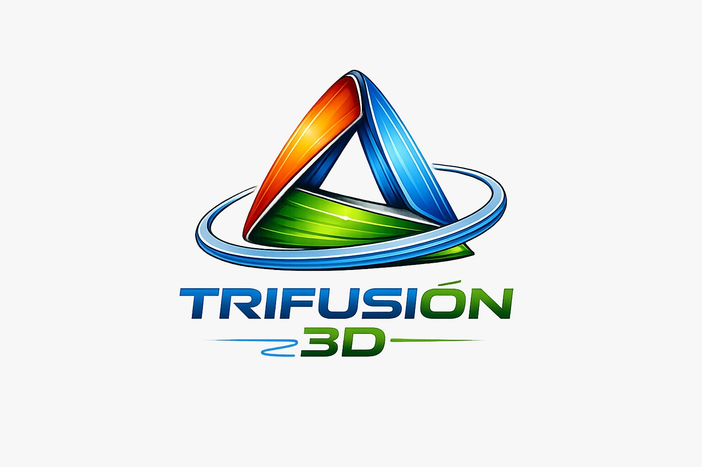

# TriFusión 3D – Smart Dry Cabinet

Repositorio oficial del producto **TF3D-SDC-01**.



## Estado

- Versión: `v0.3.2`
- Sprint: `3.2 – Diseño mecánico del primer prototipo`
- Estado: paquete de fabricación preliminar para prototipo
- Dimensiones exteriores: **800 × 1000 × 500 mm**
- Material principal: melamina blanca de **18 mm**
- Capacidad objetivo: **16 carretes**
- Control previsto: Raspberry Pi Pico W

## Alcance de v0.3.2

- Puerta con marco de aluminio, acrílico de 6 mm y sello EPDM.
- Sistema modular de soportes individuales impresos en 3D.
- Distribución de 4 filas × 4 carretes.
- Compartimento técnico inferior.
- Preparación mecánica para sensor, ventiladores y cableado.
- Lista de corte, herrajes, perforaciones y secuencia de ensamble.
- Placa de identificación lista para personalizar y enviar a grabado láser.
- Registro de riesgos, decisiones y backlog de V2.

## Archivo CAD principal

```text
cad/assembly/TF3D-SDC-01_Assembly_v0.3.2.scad
```

## Advertencia de prototipo

Esta versión permite construir el primer prototipo, pero la producción en serie
queda condicionada a validar carga, temperatura, humedad, sellado, apertura de
puerta y accesibilidad de mantenimiento.
